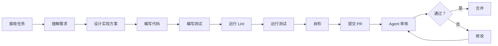

# Agent 工作指南

> 本代码仓库遵循 Harness Engineering 原则，由 Agent 自主维护和演化。
> 
> **注意**：这是一个模板文件，请根据你的项目实际情况修改内容。

## 快速开始

### 开始工作前

1. **阅读核心文档**（~15 分钟）
   - [核心架构](docs/design-docs/core-beliefs.md) - 理解操作原则
   - [架构地图](ARCHITECTURE.md) - 了解分层结构
   - [当前计划](docs/exec-plans/active/) - 明确优先级

2. **检查环境**
   ```bash
   # 验证依赖
   ./scripts/verify-setup.sh
   
   # 运行测试
   npm test
   
   # 检查代码质量
   npm run lint
   ```

3. **理解工作流程**
   - 接收任务 → 理解需求 → 实现 → 测试 → 自检 → 提交 PR
   - 所有 PR 必须通过 CI 检查
   - Agent 对 Agent 审核为主

## 文档导航

### 核心文档

| 文档 | 用途 | 位置 |
|------|------|------|
| 核心信念 | 操作原则和优先级 | `docs/design-docs/core-beliefs.md` |
| 架构地图 | 分层结构和依赖规则 | `ARCHITECTURE.md` |
| 设计系统 | UI/UX 规范 | `docs/DESIGN.md` |
| 前端规范 | 前端开发指南 | `docs/FRONTEND.md` |
| 可靠性要求 | SLO 和错误预算 | `docs/RELIABILITY.md` |
| 安全规范 | 安全最佳实践 | `docs/SECURITY.md` |

### 设计文档

- **索引**: `docs/design-docs/index.md`
- **活跃设计**: `docs/design-docs/active/`
- **已完成**: `docs/design-docs/completed/`

### 产品规格

- **索引**: `docs/product-specs/index.md`
- **功能规格**: `docs/product-specs/features/`
- **用户体验**: `docs/product-specs/ux/`

### 执行计划

- **活跃计划**: `docs/exec-plans/active/`
- **已完成**: `docs/exec-plans/completed/`
- **技术债务**: `docs/exec-plans/tech-debt-tracker.md`

### 参考文档

- **API 参考**: `docs/references/api/`
- **工具链**: `docs/references/tooling/`
- **黄金原则**: `docs/references/golden-principles.md`

## 质量门控

### 代码质量

- [ ] 所有代码通过 Lint 检查
- [ ] 测试覆盖率 ≥ 80%
- [ ] 关键路径 100% 覆盖
- [ ] 无 TypeScript 类型错误
- [ ] 遵循架构依赖规则

### 文档质量

- [ ] 代码变更同步更新文档
- [ ] 新增功能有文档说明
- [ ] API 变更更新参考文档
- [ ] 无过期文档（通过 doc-gardening 检查）

### 测试要求

- [ ] 单元测试通过
- [ ] 集成测试通过
- [ ] 端到端测试通过
- [ ] 性能测试无回归

### CI 检查

以下 CI 作业必须全部通过：

```yaml
必需检查:
  - lint: 代码质量检查
  - test: 单元测试
  - test:integration: 集成测试
  - test:e2e: 端到端测试
  - architecture: 架构依赖检查
  - docs: 文档同步检查
  - typecheck: TypeScript 类型检查
```

## 工作流程

### 标准开发流程



### 自检清单

提交 PR 前，请确认：

**代码**
- [ ] 遵循黄金原则
- [ ] 无 Lint 错误
- [ ] 测试全部通过
- [ ] 代码复杂度合理
- [ ] 命名符合规范

**文档**
- [ ] 更新相关文档
- [ ] 添加必要的注释
- [ ] 更新 API 参考
- [ ] 无拼写错误

**测试**
- [ ] 单元测试覆盖
- [ ] 集成测试覆盖
- [ ] 边界条件测试
- [ ] 错误处理测试

## 反馈回路

### 遇到问题？

按照以下步骤排查：

1. **检查文档**
   - 相关文档是否存在？
   - 文档是否清晰？
   - 文档是否过时？

2. **检查工具**
   - 是否有合适的工具？
   - 工具是否工作正常？
   - 是否需要新工具？

3. **检查约束**
   - 架构约束是否明确？
   - Lint 规则是否完整？
   - 是否需要新增规则？

4. **采取行动**
   - 文档缺失 → 创建文档
   - 工具缺失 → 开发工具
   - 规则缺失 → 编写 Lint
   - 测试缺失 → 补充测试

### 提出改进建议

发现可以改进的地方？

1. **记录问题**：在 `docs/exec-plans/tech-debt-tracker.md` 中记录
2. **提出方案**：编写改进建议文档
3. **发起讨论**：创建 PR 进行讨论
4. **实施改进**：获得批准后实施

## 常见问题

### Q: 如何知道该做什么？

**A**: 查看 `docs/exec-plans/active/` 中的活跃计划，按优先级执行。

### Q: 遇到架构决策不清楚怎么办？

**A**: 
1. 先查阅 `ARCHITECTURE.md`
2. 查看类似实现的代码
3. 如仍不清楚，创建 PR 提出问题

### Q: 如何添加新功能？

**A**:
1. 查阅产品规格文档
2. 设计实现方案
3. 按标准流程开发
4. 确保测试覆盖

### Q: 测试失败怎么办？

**A**:
1. 阅读错误信息
2. 定位失败原因
3. 修复问题
4. 重新运行测试
5. 如是 flaky test，记录并报告

### Q: 文档过时了怎么办？

**A**:
1. 立即更新文档
2. 在 PR 中说明变更
3. 通知相关方

## 工具链

### 开发工具

```bash
# 代码格式化
npm run format

# 运行 Lint
npm run lint

# 运行测试
npm test

# 类型检查
npm run typecheck

# 构建项目
npm run build
```

### 调试工具

```bash
# 启动本地环境
npm run dev

# 查看日志
npm run logs

# 性能分析
npm run profile
```

### 部署工具

```bash
# 部署到测试环境
npm run deploy:staging

# 部署到生产环境
npm run deploy:prod
```

## 联系支持

遇到问题需要人工帮助？

1. 先在代码仓库内搜索类似问题
2. 查阅故障排除文档
3. 如无法解决，联系工程团队

---

**最后更新**: 2026-03-29  
**维护者**: 工程团队  
**版本**: 1.0
